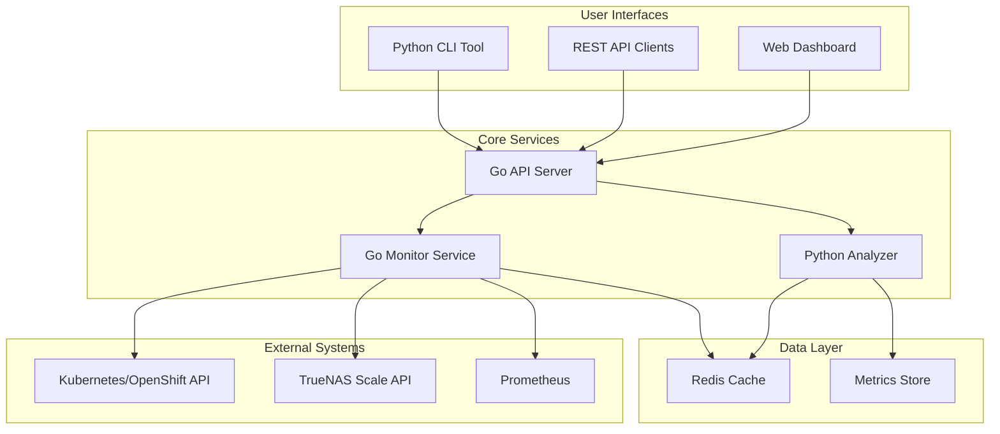
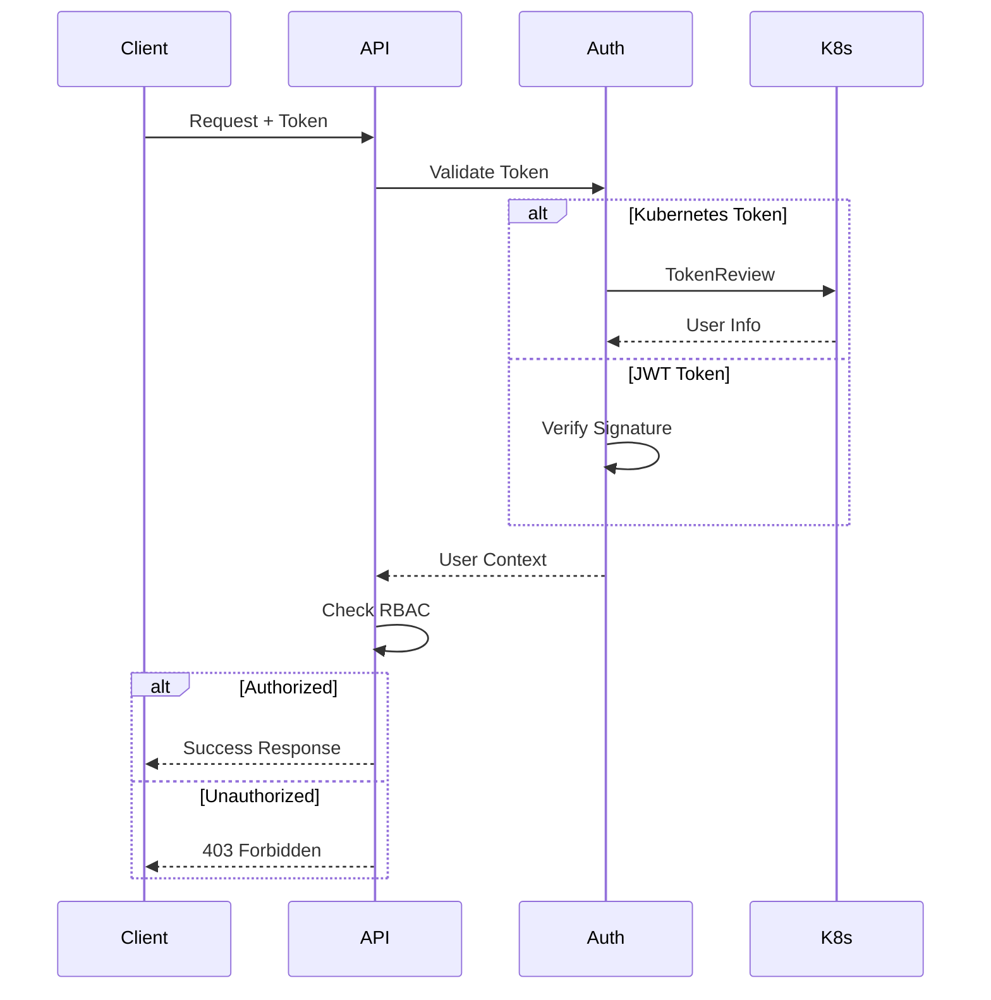
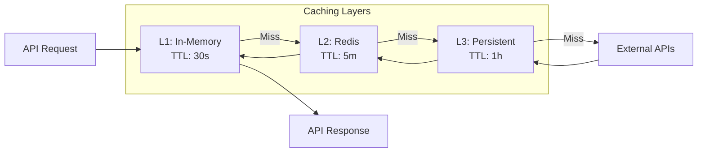

# Design Document
## Core Storage Monitoring System

### Overview

The Core Storage Monitoring System implements a hybrid Go/Python architecture that provides comprehensive monitoring capabilities for Kubernetes + TrueNAS + democratic-csi storage stacks. The system is designed with security-first principles, ensuring zero-trust architecture, complete idempotency, and enterprise-grade reliability.

### Architecture

#### High-Level System Architecture



#### Component Responsibilities

**Go API Server:**
- RESTful API endpoints for all monitoring functions
- Authentication and authorization middleware
- Rate limiting and request validation
- WebSocket support for real-time updates
- OpenAPI/Swagger documentation

**Go Monitor Service:**
- Real-time resource watching and scanning
- Orphaned resource detection algorithms
- Prometheus metrics export
- Event processing and correlation
- Health monitoring and alerting

**Python CLI Tool:**
- User-friendly command-line interface
- Multiple output formats (table, JSON, YAML)
- Interactive troubleshooting workflows
- Report generation capabilities
- Shell completion support

**Python Analyzer:**
- Storage usage trend analysis
- Capacity planning algorithms
- Anomaly detection using statistical methods
- Recommendation generation
- Historical data processing

### Components and Interfaces

#### Go Monitor Service Interface

```go
type MonitorService interface {
    Start(ctx context.Context) error
    Stop(ctx context.Context) error
    GetLastScanResult() *ScanResult
    PerformScan(ctx context.Context) (*ScanResult, error)
}

type ScanResult struct {
    Timestamp        time.Time
    OrphanedPVs      []OrphanedResource
    OrphanedPVCs     []OrphanedResource
    OrphanedSnapshots []OrphanedResource
    TotalPVs         int
    TotalPVCs        int
    TotalSnapshots   int
    ScanDuration     time.Duration
}

type OrphanedResource struct {
    Type        string
    Name        string
    Namespace   string
    Age         time.Duration
    Reason      string
    Labels      map[string]string
    Annotations map[string]string
}
```

#### Kubernetes Client Interface

```go
type K8sClient interface {
    ListPersistentVolumes(ctx context.Context) ([]corev1.PersistentVolume, error)
    ListPersistentVolumeClaims(ctx context.Context, namespace string) ([]corev1.PersistentVolumeClaim, error)
    ListVolumeSnapshots(ctx context.Context, namespace string) ([]snapshotv1.VolumeSnapshot, error)
    ListStorageClasses(ctx context.Context) ([]storagev1.StorageClass, error)
    TestConnection(ctx context.Context) error
}
```

#### TrueNAS Client Interface

```go
type TrueNASClient interface {
    ListVolumes(ctx context.Context) ([]Volume, error)
    ListSnapshots(ctx context.Context) ([]Snapshot, error)
    ListPools(ctx context.Context) ([]Pool, error)
    GetSystemInfo(ctx context.Context) (*SystemInfo, error)
    TestConnection(ctx context.Context) error
}
```

#### Python Monitor Interface

```python
class Monitor:
    def find_orphaned_resources(
        self, 
        namespace: Optional[str] = None,
        age_threshold_hours: int = 24
    ) -> Dict[str, Any]
    
    def analyze_storage_usage(
        self, 
        days: int = 7, 
        namespace: Optional[str] = None
    ) -> Dict[str, Any]
    
    def validate_configuration(self) -> Dict[str, Dict[str, Any]]
    
    def check_health(self) -> Dict[str, Any]
    
    def generate_report(self) -> Dict[str, Any]
```

### Data Models

#### Orphaned Resource Detection Model

```yaml
OrphanedResource:
  type: string              # PV, PVC, VolumeSnapshot
  name: string              # Resource name
  namespace: string         # Kubernetes namespace (if applicable)
  age: duration            # Time since creation
  reason: string           # Why it's considered orphaned
  size: string             # Storage size (if applicable)
  storage_class: string    # StorageClass name
  labels: map[string]string
  annotations: map[string]string
  truenas_reference: string # Corresponding TrueNAS object (if any)
```

#### Storage Analysis Model

```yaml
StorageAnalysis:
  timestamp: datetime
  total_allocated_bytes: int64
  total_used_bytes: int64
  thin_provisioning_efficiency: float
  pool_overcommitment_ratio: float
  growth_trend: string
  capacity_forecast: CapacityForecast
  recommendations: []string

CapacityForecast:
  days_until_full: int
  projected_growth_rate: float
  confidence_level: float
```

#### Configuration Validation Model

```yaml
ValidationResult:
  component: string
  status: string           # PASS, FAIL, WARNING
  message: string
  remediation_steps: []string
  severity: string         # LOW, MEDIUM, HIGH, CRITICAL

ValidationSummary:
  timestamp: datetime
  overall_status: boolean
  total_checks: int
  passed_checks: int
  failed_checks: int
  warning_checks: int
  results: []ValidationResult
```

### Error Handling

#### Error Classification

1. **Transient Errors** - Network timeouts, temporary API unavailability
   - Retry with exponential backoff
   - Log at DEBUG level
   - Continue operation with cached data if available

2. **Configuration Errors** - Invalid credentials, missing permissions
   - Fail fast with clear error messages
   - Log at ERROR level
   - Provide remediation guidance

3. **Data Inconsistency Errors** - Mismatched resources between systems
   - Log at WARN level
   - Flag for manual review
   - Continue processing other resources

4. **Critical System Errors** - Out of memory, disk full
   - Log at FATAL level
   - Trigger alerts
   - Graceful shutdown if necessary

#### Error Response Format

```json
{
  "error": {
    "code": "ORPHAN_SCAN_FAILED",
    "message": "Failed to scan for orphaned resources",
    "details": "Connection to TrueNAS API timed out after 30 seconds",
    "timestamp": "2024-01-15T10:30:00Z",
    "request_id": "req-12345",
    "remediation": [
      "Check TrueNAS API connectivity",
      "Verify credentials are correct",
      "Check network connectivity"
    ]
  }
}
```

### Testing Strategy

#### Unit Testing Requirements

- **Go Components**: 95% code coverage minimum
- **Python Components**: 90% code coverage minimum
- All public methods must have tests
- Mock all external dependencies
- Test both success and failure scenarios

#### Integration Testing

```yaml
Test Scenarios:
  - Kubernetes API integration
  - TrueNAS API integration
  - End-to-end orphan detection workflow
  - Configuration validation workflow
  - Metrics export functionality
  - CLI command execution
```

#### Security Testing

```yaml
Security Test Cases:
  - Credential handling (no exposure in logs)
  - TLS certificate validation
  - RBAC permission enforcement
  - Input validation and sanitization
  - Rate limiting effectiveness
  - Authentication bypass attempts
```

#### Performance Testing

```yaml
Performance Benchmarks:
  - Scan 10,000 PVs within 5 minutes
  - API response time < 500ms (95th percentile)
  - Memory usage < 500MB under normal load
  - CPU usage < 50% during scans
  - Concurrent user support (100+ users)
```

### Security Design

#### Authentication and Authorization



#### Secret Management

- Kubernetes Secrets for credential storage
- Support for external secret managers (Vault, Sealed Secrets)
- Automatic secret rotation capabilities
- No credentials in configuration files or logs
- Encrypted communication channels only

#### Network Security

- TLS 1.3 minimum for all external communications
- Certificate pinning for TrueNAS API connections
- Network policies for pod-to-pod communication
- Egress restrictions to known endpoints only

### Deployment Architecture

#### Kubernetes Deployment

```yaml
Components:
  - API Server Deployment (2+ replicas)
  - Monitor Service Deployment (1 replica with leader election)
  - CLI CronJob (for scheduled reports)
  - Redis StatefulSet (3 replicas for HA)
  - ConfigMap (configuration)
  - Secret (credentials)
  - ServiceAccount + RBAC
  - Services (ClusterIP)
  - Ingress/Route (external access)
```

#### High Availability

- API Server: Multiple replicas with load balancing
- Monitor Service: Leader election for active/standby
- Redis: Cluster mode with replication
- Persistent storage for configuration and cache
- Health checks and automatic restart policies

### Monitoring and Observability

#### Prometheus Metrics

```yaml
Metrics:
  - truenas_monitor_orphaned_pvs_total
  - truenas_monitor_orphaned_pvcs_total
  - truenas_monitor_orphaned_snapshots_total
  - truenas_monitor_scan_duration_seconds
  - truenas_monitor_storage_efficiency_percent
  - truenas_monitor_api_requests_total
  - truenas_monitor_api_request_duration_seconds
  - truenas_monitor_last_scan_timestamp
```

#### Logging Strategy

- Structured logging using JSON format
- Log levels: DEBUG, INFO, WARN, ERROR, FATAL
- Correlation IDs for request tracing
- No sensitive information in logs
- Log rotation and retention policies

#### Health Checks

```yaml
Health Endpoints:
  - /health: Basic service health
  - /ready: Readiness for traffic
  - /metrics: Prometheus metrics
  - /version: Version information
```

### Configuration Management

#### Configuration Schema

```yaml
kubernetes:
  kubeconfig: string
  in_cluster: boolean
  namespace: string

truenas:
  url: string
  username: string
  password: string
  timeout: duration
  tls_verify: boolean

monitor:
  scan_interval: duration
  orphan_threshold: duration
  snapshot_retention: duration
  max_concurrent_scans: int

metrics:
  enabled: boolean
  port: int
  path: string

alerts:
  slack:
    webhook: string
    channel: string
  email:
    smtp_server: string
    recipients: []string
```

#### Environment Variable Support

All configuration values support environment variable substitution using `${VAR_NAME}` syntax, enabling secure credential injection in containerized environments.

### Performance Optimization

#### Caching Strategy



#### Resource Optimization

- Connection pooling for external APIs
- Batch processing for large datasets
- Streaming responses for large result sets
- Compression for API responses
- Efficient data structures for in-memory processing

### Scalability Considerations

#### Horizontal Scaling

- Stateless API servers for easy scaling
- Shared cache layer (Redis) for coordination
- Leader election for monitor services
- Load balancing with session affinity
- Auto-scaling based on CPU/memory metrics

#### Data Partitioning

- Namespace-based resource partitioning
- Time-based metric partitioning
- Shard-aware caching strategies
- Distributed processing capabilities