# Architecture Document
# Kubernetes TrueNAS Democratic Tool

## Table of Contents
1. [Overview](#overview)
2. [System Architecture](#system-architecture)
3. [Component Architecture](#component-architecture)
4. [Data Flow](#data-flow)
5. [Security Architecture](#security-architecture)
6. [Deployment Architecture](#deployment-architecture)
7. [Integration Architecture](#integration-architecture)
8. [Technology Stack](#technology-stack)
9. [Scalability & Performance](#scalability--performance)
10. [High Availability](#high-availability)

## 1. Overview

The Kubernetes TrueNAS Democratic Tool follows a hybrid microservices architecture, combining Go services for performance-critical components with Python tools for flexibility and analysis. The system is designed with security-first principles, ensuring zero-trust architecture and complete idempotency.

### High-Level Architecture

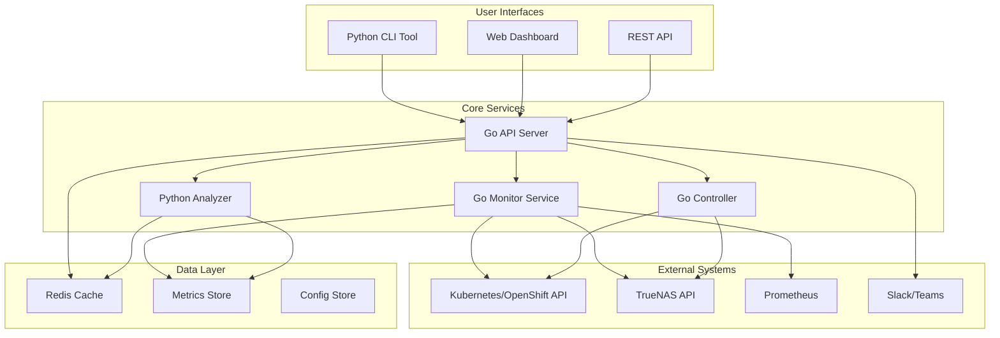
```mermaid
graph TB
    subgraph "User Interfaces"
        CLI[Python CLI Tool]
        API[REST API]
        WEB[Web Dashboard]
    end
    
    subgraph "Core Services"
        MONITOR[Go Monitor Service]
        APISERVER[Go API Server]
        CONTROLLER[Go Controller]
        ANALYZER[Python Analyzer]
    end
    
    subgraph "External Systems"
        K8S[Kubernetes/OpenShift API]
        TRUENAS[TrueNAS API]
        PROM[Prometheus]
        SLACK[Slack/Teams]
    end
    
    subgraph "Data Layer"
        CACHE[Redis Cache]
        METRICS[Metrics Store]
        CONFIG[Config Store]
    end
    
    CLI --> APISERVER
    WEB --> APISERVER
    API --> APISERVER
    
    APISERVER --> MONITOR
    APISERVER --> CONTROLLER
    APISERVER --> ANALYZER
    APISERVER --> CACHE
    
    MONITOR --> K8S
    MONITOR --> TRUENAS
    MONITOR --> METRICS
    
    CONTROLLER --> K8S
    CONTROLLER --> TRUENAS
    
    ANALYZER --> CACHE
    ANALYZER --> METRICS
    
    MONITOR --> PROM
    APISERVER --> SLACK
```

## 2. System Architecture

### 2.1 Component Overview

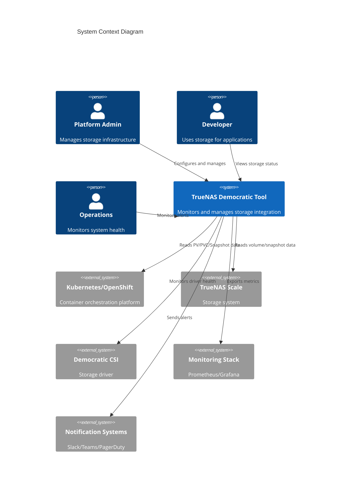
```mermaid
C4Context
    title System Context Diagram
    
    Person(admin, "Platform Admin", "Manages storage infrastructure")
    Person(dev, "Developer", "Uses storage for applications")
    Person(ops, "Operations", "Monitors system health")
    
    System(tool, "TrueNAS Democratic Tool", "Monitors and manages storage integration")
    
    System_Ext(k8s, "Kubernetes/OpenShift", "Container orchestration platform")
    System_Ext(truenas, "TrueNAS Scale", "Storage system")
    System_Ext(csi, "Democratic CSI", "Storage driver")
    System_Ext(monitoring, "Monitoring Stack", "Prometheus/Grafana")
    System_Ext(notify, "Notification Systems", "Slack/Teams/PagerDuty")
    
    Rel(admin, tool, "Configures and manages")
    Rel(dev, tool, "Views storage status")
    Rel(ops, tool, "Monitors alerts")
    
    Rel(tool, k8s, "Reads PV/PVC/Snapshot data")
    Rel(tool, truenas, "Reads volume/snapshot data")
    Rel(tool, csi, "Monitors driver health")
    Rel(tool, monitoring, "Exports metrics")
    Rel(tool, notify, "Sends alerts")
```

### 2.2 Container Diagram

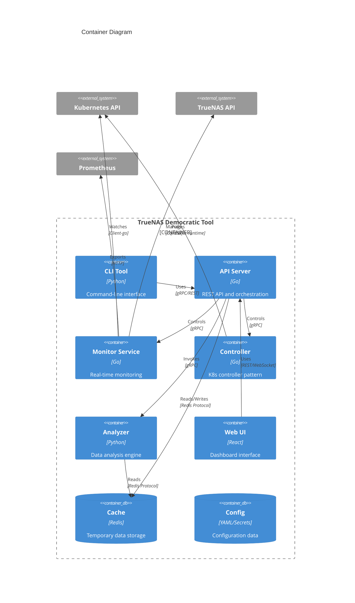
```mermaid
C4Container
    title Container Diagram
    
    Container_Boundary(tool, "TrueNAS Democratic Tool") {
        Container(cli, "CLI Tool", "Python", "Command-line interface")
        Container(api, "API Server", "Go", "REST API and orchestration")
        Container(monitor, "Monitor Service", "Go", "Real-time monitoring")
        Container(controller, "Controller", "Go", "K8s controller pattern")
        Container(analyzer, "Analyzer", "Python", "Data analysis engine")
        Container(web, "Web UI", "React", "Dashboard interface")
        
        ContainerDb(cache, "Cache", "Redis", "Temporary data storage")
        ContainerDb(config, "Config", "YAML/Secrets", "Configuration data")
    }
    
    System_Ext(k8s, "Kubernetes API")
    System_Ext(truenas, "TrueNAS API")
    System_Ext(prom, "Prometheus")
    
    Rel(cli, api, "Uses", "gRPC/REST")
    Rel(web, api, "Uses", "REST/WebSocket")
    Rel(api, monitor, "Controls", "gRPC")
    Rel(api, controller, "Controls", "gRPC")
    Rel(api, analyzer, "Invokes", "gRPC")
    Rel(api, cache, "Reads/Writes", "Redis Protocol")
    
    Rel(monitor, k8s, "Watches", "Client-go")
    Rel(monitor, truenas, "Polls", "REST")
    Rel(monitor, prom, "Exports", "HTTP")
    Rel(controller, k8s, "Manages", "Controller-runtime")
    
    Rel(analyzer, cache, "Reads", "Redis Protocol")
```

## 3. Component Architecture

### 3.1 Monitor Service (Go)

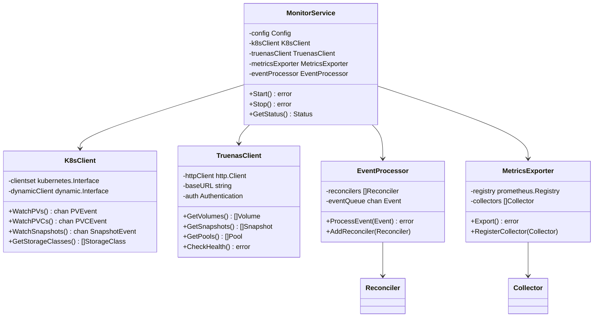
```mermaid
classDiagram
    class MonitorService {
        -config Config
        -k8sClient K8sClient
        -truenasClient TruenasClient
        -metricsExporter MetricsExporter
        -eventProcessor EventProcessor
        +Start() error
        +Stop() error
        +GetStatus() Status
    }
    
    class K8sClient {
        -clientset kubernetes.Interface
        -dynamicClient dynamic.Interface
        +WatchPVs() chan PVEvent
        +WatchPVCs() chan PVCEvent
        +WatchSnapshots() chan SnapshotEvent
        +GetStorageClasses() []StorageClass
    }
    
    class TruenasClient {
        -httpClient http.Client
        -baseURL string
        -auth Authentication
        +GetVolumes() []Volume
        +GetSnapshots() []Snapshot
        +GetPools() []Pool
        +CheckHealth() error
    }
    
    class EventProcessor {
        -reconcilers []Reconciler
        -eventQueue chan Event
        +ProcessEvent(Event) error
        +AddReconciler(Reconciler)
    }
    
    class MetricsExporter {
        -registry prometheus.Registry
        -collectors []Collector
        +Export() error
        +RegisterCollector(Collector)
    }
    
    MonitorService --> K8sClient
    MonitorService --> TruenasClient
    MonitorService --> EventProcessor
    MonitorService --> MetricsExporter
    EventProcessor --> Reconciler
    MetricsExporter --> Collector
```

### 3.2 API Server (Go)

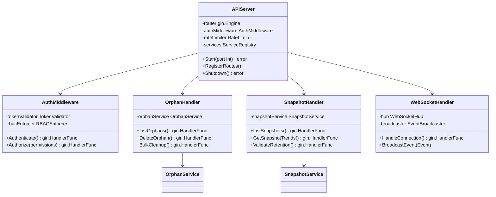
```mermaid
classDiagram
    class APIServer {
        -router gin.Engine
        -authMiddleware AuthMiddleware
        -rateLimiter RateLimiter
        -services ServiceRegistry
        +Start(port int) error
        +RegisterRoutes()
        +Shutdown() error
    }
    
    class AuthMiddleware {
        -tokenValidator TokenValidator
        -rbacEnforcer RBACEnforcer
        +Authenticate() gin.HandlerFunc
        +Authorize(permissions) gin.HandlerFunc
    }
    
    class OrphanHandler {
        -orphanService OrphanService
        +ListOrphans() gin.HandlerFunc
        +DeleteOrphan() gin.HandlerFunc
        +BulkCleanup() gin.HandlerFunc
    }
    
    class SnapshotHandler {
        -snapshotService SnapshotService
        +ListSnapshots() gin.HandlerFunc
        +GetSnapshotTrends() gin.HandlerFunc
        +ValidateRetention() gin.HandlerFunc
    }
    
    class WebSocketHandler {
        -hub WebSocketHub
        -broadcaster EventBroadcaster
        +HandleConnection() gin.HandlerFunc
        +BroadcastEvent(Event)
    }
    
    APIServer --> AuthMiddleware
    APIServer --> OrphanHandler
    APIServer --> SnapshotHandler
    APIServer --> WebSocketHandler
    OrphanHandler --> OrphanService
    SnapshotHandler --> SnapshotService
```

### 3.3 Analysis Engine (Python)

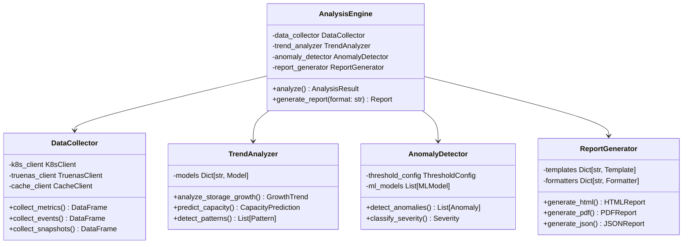
```mermaid
classDiagram
    class AnalysisEngine {
        -data_collector DataCollector
        -trend_analyzer TrendAnalyzer
        -anomaly_detector AnomalyDetector
        -report_generator ReportGenerator
        +analyze() AnalysisResult
        +generate_report(format: str) Report
    }
    
    class DataCollector {
        -k8s_client K8sClient
        -truenas_client TruenasClient
        -cache_client CacheClient
        +collect_metrics() DataFrame
        +collect_events() DataFrame
        +collect_snapshots() DataFrame
    }
    
    class TrendAnalyzer {
        -models Dict[str, Model]
        +analyze_storage_growth() GrowthTrend
        +predict_capacity() CapacityPrediction
        +detect_patterns() List[Pattern]
    }
    
    class AnomalyDetector {
        -threshold_config ThresholdConfig
        -ml_models List[MLModel]
        +detect_anomalies() List[Anomaly]
        +classify_severity() Severity
    }
    
    class ReportGenerator {
        -templates Dict[str, Template]
        -formatters Dict[str, Formatter]
        +generate_html() HTMLReport
        +generate_pdf() PDFReport
        +generate_json() JSONReport
    }
    
    AnalysisEngine --> DataCollector
    AnalysisEngine --> TrendAnalyzer
    AnalysisEngine --> AnomalyDetector
    AnalysisEngine --> ReportGenerator
```

## 4. Data Flow

### 4.1 Orphan Detection Flow

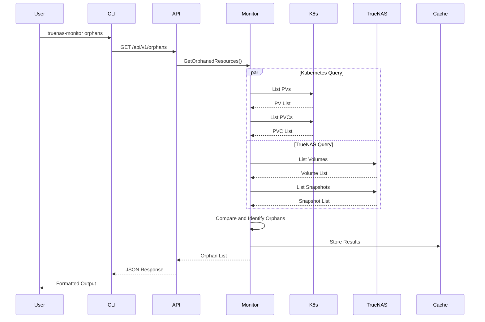
```mermaid
sequenceDiagram
    participant User
    participant CLI
    participant API
    participant Monitor
    participant K8s
    participant TrueNAS
    participant Cache
    
    User->>CLI: truenas-monitor orphans
    CLI->>API: GET /api/v1/orphans
    API->>Monitor: GetOrphanedResources()
    
    par Kubernetes Query
        Monitor->>K8s: List PVs
        K8s-->>Monitor: PV List
        Monitor->>K8s: List PVCs
        K8s-->>Monitor: PVC List
    and TrueNAS Query
        Monitor->>TrueNAS: List Volumes
        TrueNAS-->>Monitor: Volume List
        Monitor->>TrueNAS: List Snapshots
        TrueNAS-->>Monitor: Snapshot List
    end
    
    Monitor->>Monitor: Compare and Identify Orphans
    Monitor->>Cache: Store Results
    Monitor-->>API: Orphan List
    API-->>CLI: JSON Response
    CLI-->>User: Formatted Output
```

### 4.2 Real-time Monitoring Flow

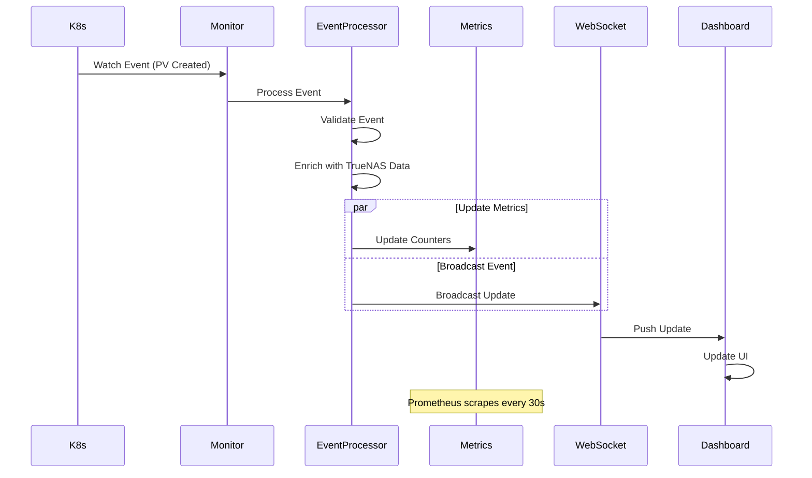
```mermaid
sequenceDiagram
    participant K8s
    participant Monitor
    participant EventProcessor
    participant Metrics
    participant WebSocket
    participant Dashboard
    
    K8s->>Monitor: Watch Event (PV Created)
    Monitor->>EventProcessor: Process Event
    
    EventProcessor->>EventProcessor: Validate Event
    EventProcessor->>EventProcessor: Enrich with TrueNAS Data
    
    par Update Metrics
        EventProcessor->>Metrics: Update Counters
    and Broadcast Event
        EventProcessor->>WebSocket: Broadcast Update
    end
    
    WebSocket->>Dashboard: Push Update
    Dashboard->>Dashboard: Update UI
    
    Note over Metrics: Prometheus scrapes every 30s
```

### 4.3 Auto-Remediation Flow

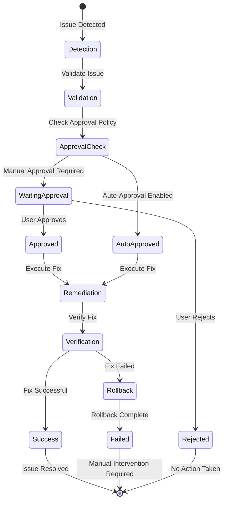
```mermaid
stateDiagram-v2
    [*] --> Detection: Issue Detected
    Detection --> Validation: Validate Issue
    Validation --> ApprovalCheck: Check Approval Policy
    
    ApprovalCheck --> WaitingApproval: Manual Approval Required
    ApprovalCheck --> AutoApproved: Auto-Approval Enabled
    
    WaitingApproval --> Approved: User Approves
    WaitingApproval --> Rejected: User Rejects
    
    Approved --> Remediation: Execute Fix
    AutoApproved --> Remediation: Execute Fix
    
    Remediation --> Verification: Verify Fix
    Verification --> Success: Fix Successful
    Verification --> Rollback: Fix Failed
    
    Rollback --> Failed: Rollback Complete
    
    Success --> [*]: Issue Resolved
    Failed --> [*]: Manual Intervention Required
    Rejected --> [*]: No Action Taken
```

## 5. Security Architecture

### 5.1 Authentication & Authorization Flow

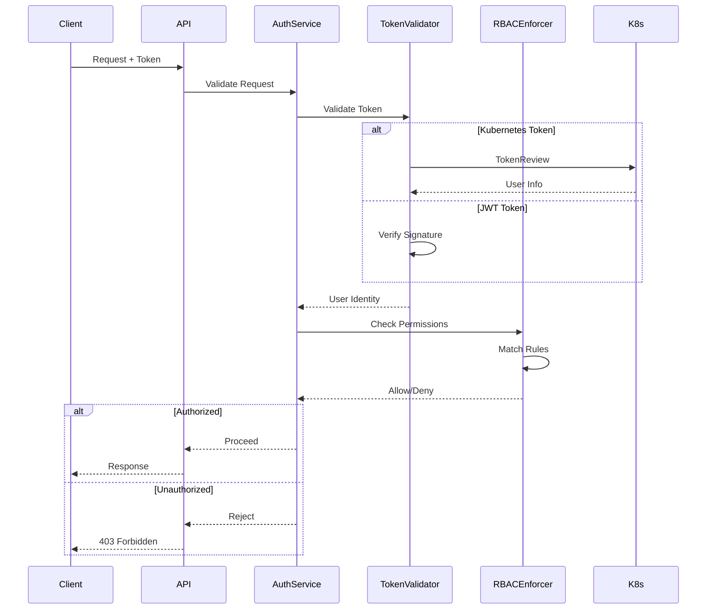
```mermaid
sequenceDiagram
    participant Client
    participant API
    participant AuthService
    participant TokenValidator
    participant RBACEnforcer
    participant K8s
    
    Client->>API: Request + Token
    API->>AuthService: Validate Request
    
    AuthService->>TokenValidator: Validate Token
    
    alt Kubernetes Token
        TokenValidator->>K8s: TokenReview
        K8s-->>TokenValidator: User Info
    else JWT Token
        TokenValidator->>TokenValidator: Verify Signature
    end
    
    TokenValidator-->>AuthService: User Identity
    
    AuthService->>RBACEnforcer: Check Permissions
    RBACEnforcer->>RBACEnforcer: Match Rules
    RBACEnforcer-->>AuthService: Allow/Deny
    
    alt Authorized
        AuthService-->>API: Proceed
        API-->>Client: Response
    else Unauthorized
        AuthService-->>API: Reject
        API-->>Client: 403 Forbidden
    end
```

### 5.2 Secret Management

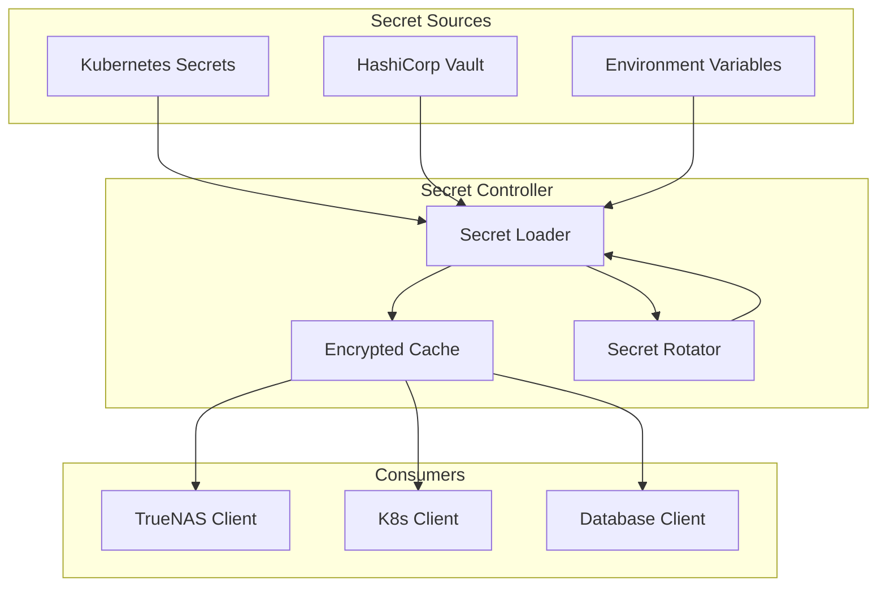
```mermaid
graph TB
    subgraph "Secret Sources"
        KS[Kubernetes Secrets]
        VAULT[HashiCorp Vault]
        ENV[Environment Variables]
    end
    
    subgraph "Secret Controller"
        LOADER[Secret Loader]
        CACHE[Encrypted Cache]
        ROTATOR[Secret Rotator]
    end
    
    subgraph "Consumers"
        TRUENAS_CLIENT[TrueNAS Client]
        K8S_CLIENT[K8s Client]
        DB_CLIENT[Database Client]
    end
    
    KS --> LOADER
    VAULT --> LOADER
    ENV --> LOADER
    
    LOADER --> CACHE
    LOADER --> ROTATOR
    
    CACHE --> TRUENAS_CLIENT
    CACHE --> K8S_CLIENT
    CACHE --> DB_CLIENT
    
    ROTATOR --> LOADER
```

## 6. Deployment Architecture

### 6.1 Kubernetes Deployment

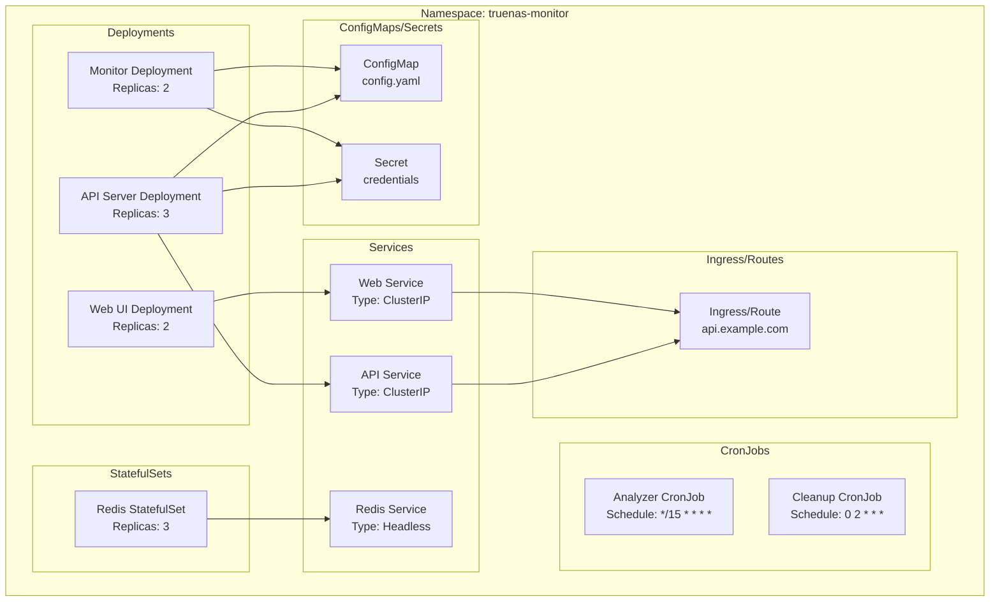
```mermaid
graph TB
    subgraph "Namespace: truenas-monitor"
        subgraph "Deployments"
            API_DEP[API Server Deployment<br/>Replicas: 3]
            MON_DEP[Monitor Deployment<br/>Replicas: 2]
            WEB_DEP[Web UI Deployment<br/>Replicas: 2]
        end
        
        subgraph "StatefulSets"
            REDIS[Redis StatefulSet<br/>Replicas: 3]
        end
        
        subgraph "CronJobs"
            ANALYZER[Analyzer CronJob<br/>Schedule: */15 * * * *]
            CLEANUP[Cleanup CronJob<br/>Schedule: 0 2 * * *]
        end
        
        subgraph "Services"
            API_SVC[API Service<br/>Type: ClusterIP]
            WEB_SVC[Web Service<br/>Type: ClusterIP]
            REDIS_SVC[Redis Service<br/>Type: Headless]
        end
        
        subgraph "Ingress/Routes"
            INGRESS[Ingress/Route<br/>api.example.com]
        end
        
        subgraph "ConfigMaps/Secrets"
            CONFIG[ConfigMap<br/>config.yaml]
            SECRET[Secret<br/>credentials]
        end
    end
    
    API_DEP --> API_SVC
    WEB_DEP --> WEB_SVC
    REDIS --> REDIS_SVC
    
    API_SVC --> INGRESS
    WEB_SVC --> INGRESS
    
    API_DEP --> CONFIG
    API_DEP --> SECRET
    MON_DEP --> CONFIG
    MON_DEP --> SECRET
```

### 6.2 High Availability Architecture

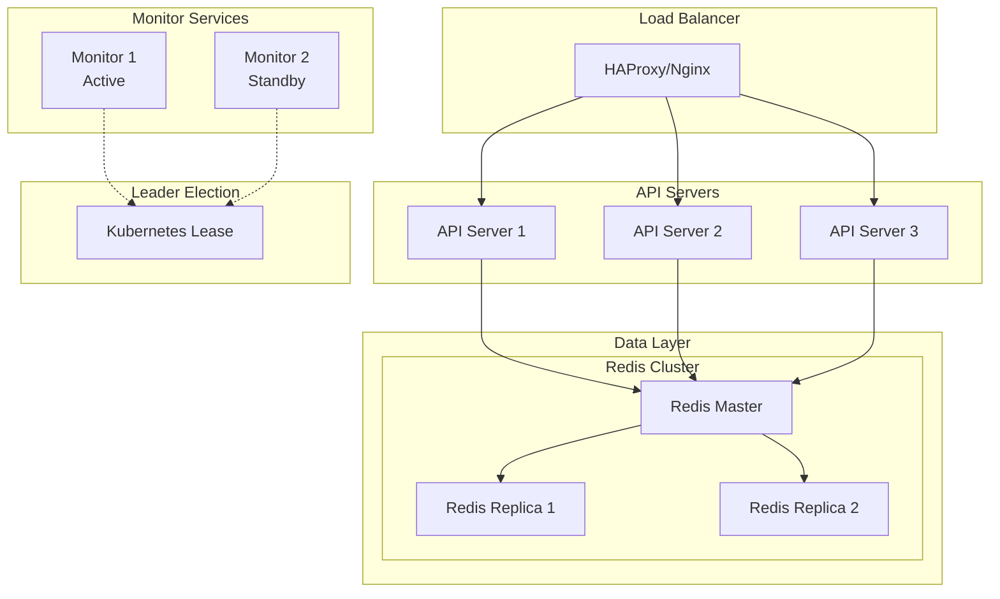
```mermaid
graph TB
    subgraph "Load Balancer"
        LB[HAProxy/Nginx]
    end
    
    subgraph "API Servers"
        API1[API Server 1]
        API2[API Server 2]
        API3[API Server 3]
    end
    
    subgraph "Monitor Services"
        MON1[Monitor 1<br/>Active]
        MON2[Monitor 2<br/>Standby]
    end
    
    subgraph "Data Layer"
        subgraph "Redis Cluster"
            REDIS1[Redis Master]
            REDIS2[Redis Replica 1]
            REDIS3[Redis Replica 2]
        end
    end
    
    subgraph "Leader Election"
        LEASE[Kubernetes Lease]
    end
    
    LB --> API1
    LB --> API2
    LB --> API3
    
    API1 --> REDIS1
    API2 --> REDIS1
    API3 --> REDIS1
    
    MON1 -.-> LEASE
    MON2 -.-> LEASE
    
    REDIS1 --> REDIS2
    REDIS1 --> REDIS3
```

## 7. Integration Architecture

### 7.1 External System Integration

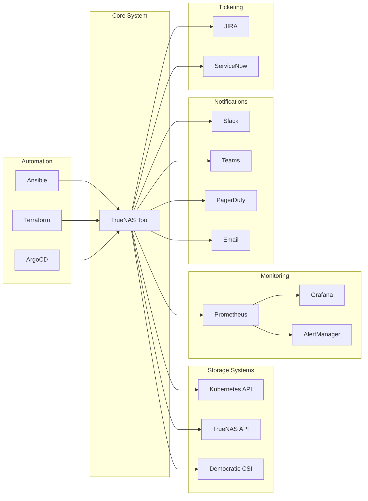
```mermaid
graph LR
    subgraph "Core System"
        TOOL[TrueNAS Tool]
    end
    
    subgraph "Storage Systems"
        K8S[Kubernetes API]
        TRUENAS[TrueNAS API]
        CSI[Democratic CSI]
    end
    
    subgraph "Monitoring"
        PROM[Prometheus]
        GRAFANA[Grafana]
        ALERTS[AlertManager]
    end
    
    subgraph "Notifications"
        SLACK[Slack]
        TEAMS[Teams]
        PAGER[PagerDuty]
        EMAIL[Email]
    end
    
    subgraph "Ticketing"
        JIRA[JIRA]
        SNOW[ServiceNow]
    end
    
    subgraph "Automation"
        ANSIBLE[Ansible]
        TERRAFORM[Terraform]
        ARGO[ArgoCD]
    end
    
    TOOL --> K8S
    TOOL --> TRUENAS
    TOOL --> CSI
    
    TOOL --> PROM
    PROM --> GRAFANA
    PROM --> ALERTS
    
    TOOL --> SLACK
    TOOL --> TEAMS
    TOOL --> PAGER
    TOOL --> EMAIL
    
    TOOL --> JIRA
    TOOL --> SNOW
    
    ANSIBLE --> TOOL
    TERRAFORM --> TOOL
    ARGO --> TOOL
```

### 7.2 API Integration Pattern

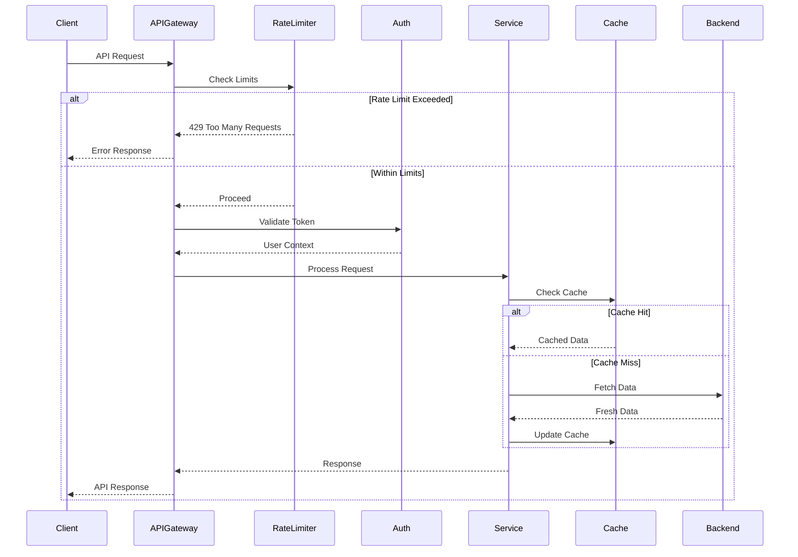
```mermaid
sequenceDiagram
    participant Client
    participant APIGateway
    participant RateLimiter
    participant Auth
    participant Service
    participant Cache
    participant Backend
    
    Client->>APIGateway: API Request
    APIGateway->>RateLimiter: Check Limits
    
    alt Rate Limit Exceeded
        RateLimiter-->>APIGateway: 429 Too Many Requests
        APIGateway-->>Client: Error Response
    else Within Limits
        RateLimiter-->>APIGateway: Proceed
        APIGateway->>Auth: Validate Token
        Auth-->>APIGateway: User Context
        
        APIGateway->>Service: Process Request
        Service->>Cache: Check Cache
        
        alt Cache Hit
            Cache-->>Service: Cached Data
        else Cache Miss
            Service->>Backend: Fetch Data
            Backend-->>Service: Fresh Data
            Service->>Cache: Update Cache
        end
        
        Service-->>APIGateway: Response
        APIGateway-->>Client: API Response
    end
```

## 8. Technology Stack

### 8.1 Languages & Frameworks

| Component | Language | Framework | Purpose |
|-----------|----------|-----------|---------|
| Monitor Service | Go 1.21+ | client-go, controller-runtime | Performance-critical monitoring |
| API Server | Go 1.21+ | Gin/Echo, gRPC | High-performance API |
| Controller | Go 1.21+ | controller-runtime | Kubernetes native controller |
| CLI Tool | Python 3.10+ | Click, Rich | User-friendly interface |
| Analyzer | Python 3.10+ | Pandas, NumPy, Scikit-learn | Data analysis and ML |
| Web UI | TypeScript | React, Material-UI | Modern dashboard |

### 8.2 Infrastructure & Tools

| Category | Technology | Purpose |
|----------|------------|---------|
| Container Runtime | Docker/Podman | Containerization |
| Orchestration | Kubernetes/OpenShift | Container orchestration |
| Cache | Redis | Temporary data storage |
| Metrics | Prometheus | Time-series metrics |
| Tracing | OpenTelemetry | Distributed tracing |
| Logging | Fluentd/Fluentbit | Log aggregation |
| CI/CD | GitHub Actions | Automation |
| Security | Trivy, Snyk | Vulnerability scanning |

## 9. Scalability & Performance

### 9.1 Horizontal Scaling Strategy

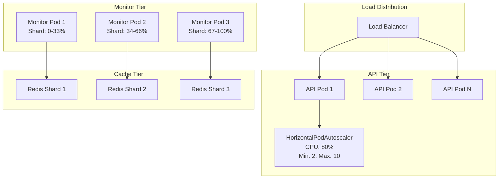
```mermaid
graph TB
    subgraph "Load Distribution"
        LB[Load Balancer]
    end
    
    subgraph "API Tier" 
        API1[API Pod 1]
        API2[API Pod 2]
        APIN[API Pod N]
        HPA1[HorizontalPodAutoscaler<br/>CPU: 80%<br/>Min: 2, Max: 10]
    end
    
    subgraph "Monitor Tier"
        MON1[Monitor Pod 1<br/>Shard: 0-33%]
        MON2[Monitor Pod 2<br/>Shard: 34-66%]
        MON3[Monitor Pod 3<br/>Shard: 67-100%]
    end
    
    subgraph "Cache Tier"
        REDIS1[Redis Shard 1]
        REDIS2[Redis Shard 2]
        REDIS3[Redis Shard 3]
    end
    
    LB --> API1
    LB --> API2
    LB --> APIN
    
    API1 --> HPA1
    
    MON1 --> REDIS1
    MON2 --> REDIS2
    MON3 --> REDIS3
```

### 9.2 Performance Optimization

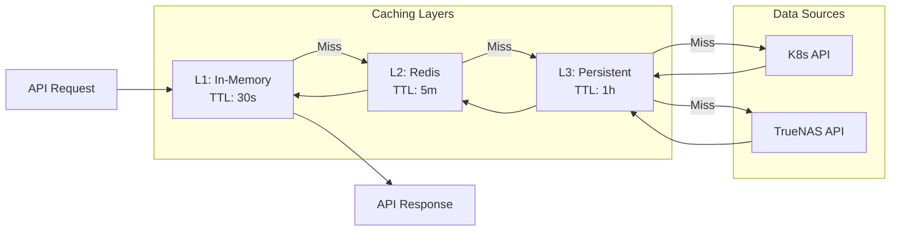
```mermaid
graph LR
    subgraph "Caching Layers"
        L1[L1: In-Memory<br/>TTL: 30s]
        L2[L2: Redis<br/>TTL: 5m]
        L3[L3: Persistent<br/>TTL: 1h]
    end
    
    subgraph "Data Sources"
        K8S[K8s API]
        TRUENAS[TrueNAS API]
    end
    
    REQUEST[API Request] --> L1
    L1 -->|Miss| L2
    L2 -->|Miss| L3
    L3 -->|Miss| K8S
    L3 -->|Miss| TRUENAS
    
    K8S --> L3
    TRUENAS --> L3
    L3 --> L2
    L2 --> L1
    L1 --> RESPONSE[API Response]
```

## 10. High Availability

### 10.1 Failure Scenarios

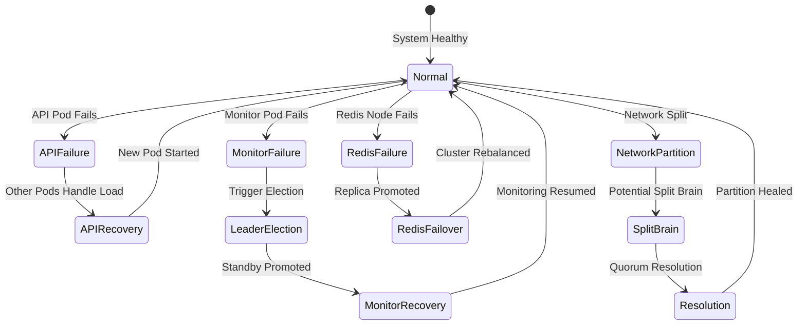
```mermaid
stateDiagram-v2
    [*] --> Normal: System Healthy
    
    Normal --> APIFailure: API Pod Fails
    APIFailure --> APIRecovery: Other Pods Handle Load
    APIRecovery --> Normal: New Pod Started
    
    Normal --> MonitorFailure: Monitor Pod Fails
    MonitorFailure --> LeaderElection: Trigger Election
    LeaderElection --> MonitorRecovery: Standby Promoted
    MonitorRecovery --> Normal: Monitoring Resumed
    
    Normal --> RedisFailure: Redis Node Fails
    RedisFailure --> RedisFailover: Replica Promoted
    RedisFailover --> Normal: Cluster Rebalanced
    
    Normal --> NetworkPartition: Network Split
    NetworkPartition --> SplitBrain: Potential Split Brain
    SplitBrain --> Resolution: Quorum Resolution
    Resolution --> Normal: Partition Healed
```

### 10.2 Disaster Recovery

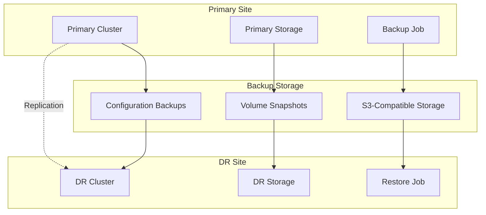
```mermaid
graph TB
    subgraph "Primary Site"
        PRIM_CLUSTER[Primary Cluster]
        PRIM_STORAGE[Primary Storage]
        PRIM_BACKUP[Backup Job]
    end
    
    subgraph "Backup Storage"
        S3[S3-Compatible Storage]
        SNAPSHOTS[Volume Snapshots]
        CONFIGS[Configuration Backups]
    end
    
    subgraph "DR Site"
        DR_CLUSTER[DR Cluster]
        DR_STORAGE[DR Storage]
        DR_RESTORE[Restore Job]
    end
    
    PRIM_BACKUP --> S3
    PRIM_STORAGE --> SNAPSHOTS
    PRIM_CLUSTER --> CONFIGS
    
    S3 --> DR_RESTORE
    SNAPSHOTS --> DR_STORAGE
    CONFIGS --> DR_CLUSTER
    
    PRIM_CLUSTER -.->|Replication| DR_CLUSTER
```

## 11. Development & Testing Architecture

### 11.1 Development Workflow

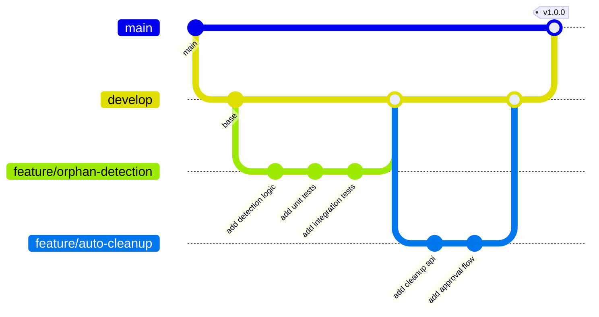
```mermaid
gitGraph
    commit id: "main"
    branch develop
    checkout develop
    commit id: "base"
    
    branch feature/orphan-detection
    checkout feature/orphan-detection
    commit id: "add detection logic"
    commit id: "add unit tests"
    commit id: "add integration tests"
    
    checkout develop
    merge feature/orphan-detection
    
    branch feature/auto-cleanup
    checkout feature/auto-cleanup
    commit id: "add cleanup api"
    commit id: "add approval flow"
    
    checkout develop
    merge feature/auto-cleanup
    
    checkout main
    merge develop tag: "v1.0.0"
```

### 11.2 Testing Strategy

```mermaid
graph TB
    subgraph "Test Pyramid"
        UNIT[Unit Tests<br/>90% Coverage<br/>~1000 tests]
        INTEGRATION[Integration Tests<br/>80% Coverage<br/>~200 tests]
        E2E[E2E Tests<br/>Critical Paths<br/>~50 tests]
        SECURITY[Security Tests<br/>OWASP Top 10<br/>~30 tests]
    end
    
    subgraph "Test Environments"
        LOCAL[Local Dev<br/>Mocked Services]
        CI[CI Environment<br/>Kind Cluster]
        STAGING[Staging<br/>Full Stack]
        PROD[Production<br/>Canary Tests]
    end
    
    UNIT --> LOCAL
    INTEGRATION --> CI
    E2E --> STAGING
    SECURITY --> STAGING
    
    STAGING --> PROD
```

## 12. Monitoring & Observability

### 12.1 Metrics Architecture

```mermaid
graph TB
    subgraph "Application Metrics"
        APP[Application]
        CUSTOM[Custom Metrics]
        RUNTIME[Runtime Metrics]
    end
    
    subgraph "Exporters"
        PROM_EXP[Prometheus Exporter]
        OTEL_EXP[OpenTelemetry Exporter]
    end
    
    subgraph "Collection"
        PROM[Prometheus]
        JAEGER[Jaeger]
        LOKI[Loki]
    end
    
    subgraph "Visualization"
        GRAFANA[Grafana]
        ALERTS[AlertManager]
    end
    
    APP --> CUSTOM
    APP --> RUNTIME
    
    CUSTOM --> PROM_EXP
    RUNTIME --> PROM_EXP
    APP --> OTEL_EXP
    
    PROM_EXP --> PROM
    OTEL_EXP --> JAEGER
    APP --> LOKI
    
    PROM --> GRAFANA
    PROM --> ALERTS
    JAEGER --> GRAFANA
    LOKI --> GRAFANA
```

### 12.2 Distributed Tracing

```mermaid
sequenceDiagram
    participant User
    participant API
    participant Monitor
    participant K8s
    participant TrueNAS
    participant Jaeger
    
    User->>API: Request (Trace ID: 123)
    API->>API: Start Span "api.request"
    API->>Monitor: Check Orphans (Trace ID: 123)
    Monitor->>Monitor: Start Span "monitor.check"
    
    par Query K8s
        Monitor->>K8s: List PVs (Trace ID: 123)
        K8s-->>Monitor: PV Data
    and Query TrueNAS
        Monitor->>TrueNAS: List Volumes (Trace ID: 123)
        TrueNAS-->>Monitor: Volume Data
    end
    
    Monitor->>Monitor: End Span "monitor.check"
    Monitor-->>API: Results
    API->>API: End Span "api.request"
    API-->>User: Response
    
    API->>Jaeger: Send Trace
    Monitor->>Jaeger: Send Trace
```

## Conclusion

This architecture provides a robust, scalable, and secure foundation for the Kubernetes TrueNAS Democratic Tool. The hybrid Go/Python approach leverages the strengths of both languages, while the microservices architecture ensures modularity and maintainability. The comprehensive security measures and idempotent design patterns make it suitable for production enterprise environments.